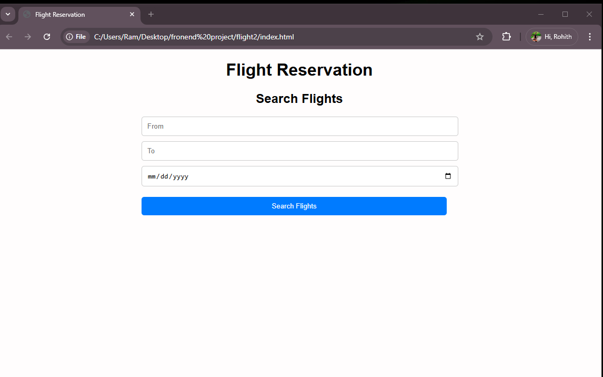

<h1>
  Flight reservation 
</h1>
<h3>
  summary 
</h3>

I developed a flight reservation web page using HTML, CSS, and JavaScript to simplify the booking process. The interface includes an intuitive search form where users can input travel details such as departure and arrival cities, travel dates, and passenger count. The page dynamically displays available flight options based on user preferences.

JavaScript handles key functionalities, such as form validation, interactive date pickers, and real-time filtering of flight results. CSS ensures a visually appealing and responsive design, making the web page accessible on both desktop and mobile devices.

The web page also includes features like a summary of selected flights, cost calculation, and an interactive confirmation page to finalize reservations. This project highlights my ability to integrate front-end technologies to create a functional, aesthetically pleasing, and user-friendly platform for efficient flight booking.

<h4>
  The interface of the web page looks like the :-
</h4>

